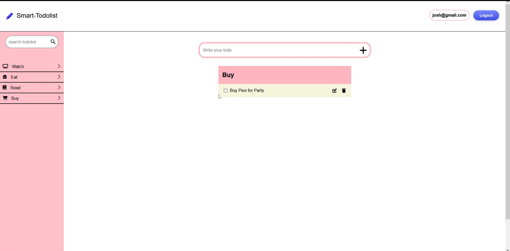

Smart Todolist
=========

## Getting Started

1. Create the `.env` by using `.env.example` as a reference: `cp .env.example .env`
2. Update the .env file with your correct local information 
  - DB_HOST: <your databae host address>
  - DB_USER: <your database user>
  - DB_PASS: <your database password>
  - DB_NAME= <your database name>
  - DB_PORT= <database port of your choice
  - AI_API_KEY=<Gemni API key>
  - SESSION_SECRET=<session secret>
  - APP_PORT=<app port of your choice>
3. Install dependencies: `npm i`
4. Fix to binaries for sass: `npm rebuild node-sass`
5. Reset database: `npm run db:reset`
  - Check the db folder to see what gets created and seeded in the SDB
7. Run the server: `npm run local`
  - Note: nodemon is used, so you should not have to restart your server
8. Visit `http://localhost:<APP_PORT>/`

## Dependencies

- Node 10.x or above
- NPM 5.x or above
- PG 6.x
